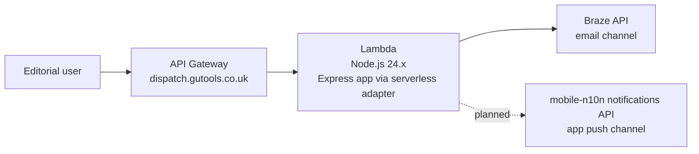

# Notifications tooling

A monorepo for Guardian notifications tooling.

It currently contains a single editorial tool called Dispatch (under development), used to compose and send notifications.

## Contents

- [Introduction](#1-introduction)
- [Getting Started](#2-getting-started)
- [How It Works](#3-how-it-works)
- [Useful Links](#4-useful-links)
- [Terminology](#5-terminology)

## 1. Introduction

Dispatch gives editorial staff one place to compose and send breaking-news notifications.

It replaces a fragmented workflow spread across multiple systems and legacy tooling.

Email delivery currently integrates with [Braze](https://www.braze.com/docs/developer_guide/home), and app push integration with the [notifications API](https://github.com/guardian/mobile-n10n).

## 2. Getting Started

### Prerequisites

- This project relies on [Bun](https://bun.com/). On Mac OS install its latest version using Homebrew:
  ```sh
  brew install bun
  ```
- [dev-nginx](https://github.com/guardian/dev-nginx)
- Docker (optional; required for local Postgres if needed)

### First-time setup

```bash
./scripts/setup.sh
```

### Run locally

Start both frontend and backend:

```bash
./scripts/start.sh
```

Local URLs:

- `https://dispatch.local.dev-gutools.co.uk`
- `https://dispatch-backend.local.dev-gutools.co.uk/`

Run apps separately if needed:

```bash
cd src/apps/frontend
bun run dev

cd src/apps/backend
bun run dev
```

### Optional local Postgres

Should Postgres be required, there is a minimal working ./docker/docker-compose.local.yml file and two helper scripts to start & stop docker services.

```bash
bun run docker:compose:up
bun run docker:compose:down
```

### Tests, linting, formatting, and type checks

Run from the repo root:

```bash
bun test
bun run lint
bun run lint:fix
bun run format
bun run format:check
bun run typecheck
```

Run commands for one workspace package/app when needed:

```bash
bun --filter backend test
bun --filter frontend typecheck
```

Git hooks are managed with `lefthook` and installed automatically via `bun install` (`prepare` script).

## 3. How It Works

### Core technologies

- Bun workspaces for package management and scripts.
- React (frontend) and Express + Zod validation (backend).
- AWS CDK (`@guardian/cdk`) for infrastructure definitions.

### Repository layout

- `src/apps/frontend`: UI for composing notifications.
- `src/apps/backend`: API and channel request generation.
- `src/packages`: shared packages.
- `cdk`: infrastructure stack and deployment definitions.

### Infrastructure model

This is deployed using AWS API Gateway + Lambda.



## 4. Useful Links

- Braze REST API: https://www.braze.com/docs/developer_guide/rest_api/sending_messages
- App notifications monorepo: https://github.com/guardian/mobile-n10n
- Existing Breaking News tool: https://fronts.gutools.co.uk/breaking-news
- Existing Breaking News tool code: https://github.com/guardian/facia-tool
- Bun documentation: https://bun.sh/

## 5. Terminology

- **Segment**: A target audience group (`UK`, `US`, `AU`, `EU`, `ALL`).
- **Delivery mode**: The notification timing strategy (`immediate`, `scheduled`, `intelligent`).
- **Channel**: A delivery destination such as `email` or `app-notification`.
