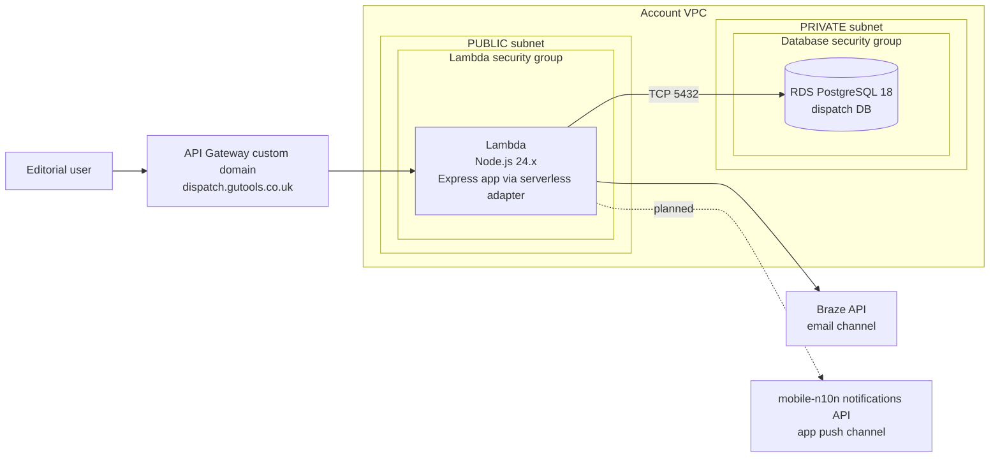

# Notifications tooling

A monorepo for Guardian notifications tooling.

It currently contains a single editorial tool called Dispatch (under development), used to compose and send notifications.

## Contents

- [Introduction](#1-introduction)
- [Getting Started](#2-getting-started)
- [How It Works](#3-how-it-works)
- [Useful Links](#4-useful-links)
- [Terminology](#5-terminology)

## 1. Introduction

Dispatch gives editorial staff one place to compose and send breaking-news notifications.

It replaces a fragmented workflow spread across multiple systems and legacy tooling.

Email delivery currently integrates with [Braze](https://www.braze.com/docs/developer_guide/home), and app push integration with the [notifications API](https://github.com/guardian/mobile-n10n).

## 2. Getting Started

### Prerequisites

- This project relies on [Bun](https://bun.com/). On Mac OS install its latest version using Homebrew:
  ```sh
  brew install bun
  ```
- [dev-nginx](https://github.com/guardian/dev-nginx)
- Docker (optional; required for local Postgres if needed)

### First-time setup

Install `dev-nginx` before `./scripts/setup.sh` can be run:

```bash
brew tap guardian/homebrew-devtools
brew install guardian/devtools/dev-nginx
```

Then:

```bash
./scripts/setup.sh
```

### Run locally

Dispatch protects its endpoints with two independent checks, and both must be
satisfied before authorised endpoints (for example `GET /v1/user`,
`POST /v1/notifications`, `POST /v1/notification-tests`) return anything other
than `401`/`403`:

1. **Authentication** — a valid pan-domain cookie (`gutoolsAuth-assym`) for the
   `local.dev-gutools.co.uk` domain. panda-auth for Node cannot mint this cookie
   itself, so you must run the [login](https://github.com/guardian/login.gutools) tool
   locally to sign in and issue it.
2. **Authorisation** — your user must hold the `dispatch_access` permission. The
   permissions store is read from the CODE bucket using the `composer` AWS
   profile. Grant yourself the permission via the CODE permissions admin UI at
   [permissions.code.dev-gutools.co.uk/admin](https://permissions.code.dev-gutools.co.uk/admin):
   find your user and enable `dispatch_access`.

Both the login tool and Dispatch read from the same **Composer** AWS account, so
a single set of Janus credentials under the `composer` profile satisfies cookie
issuance and the permissions lookup at once.

#### 1. Get Composer credentials

Fetch fresh [Janus](https://janus.gutools.co.uk/) credentials for the Composer
account into the `composer` profile (Janus -> Composer -> Run dispatch locally). Both the login tool and Dispatch expect
this profile to be present, so grab them before starting either service.

#### 2. Start the login tool

Clone and start the [login](https://github.com/guardian/login.gutools) tool in a
separate checkout so it is available alongside Dispatch:

```bash
# in your local checkout of guardian/login
./script/start
```

This serves `https://login.local.dev-gutools.co.uk`, which Dispatch redirects to
when you are unauthenticated.

#### 3. Start Dispatch

```bash
./scripts/start.sh
```

Local URL:

- `https://dispatch.local.dev-gutools.co.uk`

#### 4. Sign in

Open `https://dispatch.local.dev-gutools.co.uk`. When unauthenticated you are
redirected to `login.local.dev-gutools.co.uk`; sign in there to mint the
`gutoolsAuth-assym` cookie, then you are returned to Dispatch. With the cookie
present, authorised endpoints resolve successfully.

> This local setup currently depends on a temporary workaround. Because
> panda-auth for Node does not generate cookies, you need to run the login tool
> locally alongside Dispatch. This is implemented using the
> [new developer policies](https://github.com/guardian/janus/blob/main/docs/developer-policies.md#gucdk).
> We considered adding these policies to login directly, but both login and
> Dispatch use the same Composer AWS profile, so only one policy context can be
> active at a time.

Run apps separately if needed:

```bash
cd src/apps/frontend
bun run dev

cd src/apps/backend
bun run dev
```

### Local Postgres DB

Spin a new docker container running Postgres with

```bash
bun run db:start
```

And stop it with

```sh
bun run db:stop
```

### Tests, linting, formatting, and type checks

Run from the repo root:

```bash
bun test
bun run lint
bun run lint:fix
bun run format
bun run format:check
bun run typecheck
```

Run commands for one workspace package/app when needed:

```bash
bun --filter backend test
bun --filter frontend typecheck
```

Git hooks are managed with `lefthook` and installed automatically via `bun install` (`prepare` script).

## 3. How It Works

### Core technologies

- Bun workspaces for package management and scripts.
- React (frontend) and Express + Zod validation (backend).
- AWS CDK (`@guardian/cdk`) for infrastructure definitions.

### Repository layout

- `src/apps/frontend`: UI for composing notifications.
- `src/apps/backend`: API and channel request generation.
- `src/packages`: shared packages.
- `cdk`: infrastructure stack and deployment definitions.

### Infrastructure model

This is deployed on AWS with API Gateway, Lambda, using an RDS database.


```mermaid
flowchart LR
	Editor[Editorial user] --> APIGW[API Gateway custom domain\ndispatch.gutools.co.uk]
    APIGW --> Lambda

    subgraph VPC[Account VPC]
        subgraph SUBNET1[PUBLIC subnet]
            subgraph SG1[Lambda security group]
                Lambda[Lambda\nNode.js 24.x\nExpress app via serverless adapter]
            end
        end

        subgraph SUBNET2[PRIVATE subnet]
            subgraph SG2[Database security group]
                RDS[(RDS PostgreSQL 18\ndispatch DB)]
            end
        end
    end

    Lambda --> Braze[Braze API\nemail channel]
    Lambda -. planned .-> N10N[mobile-n10n notifications API\napp push channel]

    Lambda -->|TCP 5432| RDS
```

## 4. Useful Links

- Braze REST API: https://www.braze.com/docs/developer_guide/rest_api/sending_messages
- App notifications monorepo: https://github.com/guardian/mobile-n10n
- Existing Breaking News tool: https://fronts.gutools.co.uk/breaking-news
- Existing Breaking News tool code: https://github.com/guardian/facia-tool
- Bun documentation: https://bun.sh/

## 5. Terminology

See [CONTEXT.md](./CONTEXT.md) for the project glossary — the canonical name for
each domain concept, and the near-synonyms to avoid. It is the single source; do
not restate definitions here.
