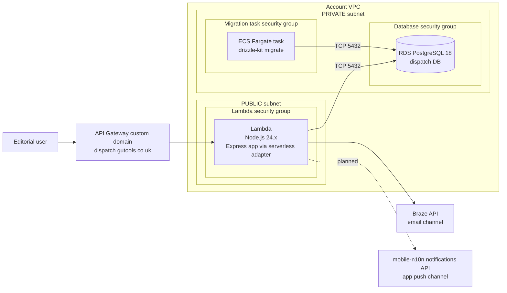

# Notifications tooling

A monorepo for Guardian notifications tooling.

It currently contains a single editorial tool called Dispatch (under development), used to compose and send notifications.

## Contents

- [Introduction](#1-introduction)
- [Getting Started](#2-getting-started)
- [How It Works](#3-how-it-works)
- [Useful Links](#4-useful-links)
- [Terminology](#5-terminology)

## 1. Introduction

Dispatch gives editorial staff one place to compose and send breaking-news notifications.

It replaces a fragmented workflow spread across multiple systems and legacy tooling.

Email delivery currently integrates with [Braze](https://www.braze.com/docs/developer_guide/home), and app push integration with the [notifications API](https://github.com/guardian/mobile-n10n).

## 2. Getting Started

### Prerequisites

- This project relies on [Bun](https://bun.com/). On Mac OS install its latest version using Homebrew:
  ```sh
  brew install bun
  ```
- [dev-nginx](https://github.com/guardian/dev-nginx)
- Docker (optional; required for local Postgres if needed)

### First-time setup

Install `dev-nginx` before `./scripts/setup.sh` can be run:

```bash
brew tap guardian/homebrew-devtools
brew install guardian/devtools/dev-nginx
```

Then:

```bash
./scripts/setup.sh
```

### Run locally

Start the service:

```bash
./scripts/start.sh
```

Local URLs:

- `https://dispatch.local.dev-gutools.co.uk`

This local setup currently depends on a temporary workaround introduced to support local development. Because panda-auth for Node does not generate cookies, you need to run the login tool locally alongside Dispatch.

This is implemented using the [new developer policies](https://github.com/guardian/janus/blob/main/docs/developer-policies.md#gucdk). We considered adding these policies to login directly, but both login and Dispatch use the same Composer AWS profile, so only one policy context can be active at a time.

Run apps separately if needed:

```bash
cd src/apps/frontend
bun run dev

cd src/apps/backend
bun run dev
```

### Local Postgres DB

Spin a new docker container running Postgres with

```bash
bun run db:start
```

And stop it with

```sh
bun run db:stop
```

### Tests, linting, formatting, and type checks

Run from the repo root:

```bash
bun test
bun run lint
bun run lint:fix
bun run format
bun run format:check
bun run typecheck
```

Run commands for one workspace package/app when needed:

```bash
bun --filter backend test
bun --filter frontend typecheck
```

Git hooks are managed with `lefthook` and installed automatically via `bun install` (`prepare` script).

## 3. How It Works

### Core technologies

- Bun workspaces for package management and scripts.
- React (frontend) and Express + Zod validation (backend).
- AWS CDK (`@guardian/cdk`) for infrastructure definitions.

### Repository layout

- `src/apps/frontend`: UI for composing notifications.
- `src/apps/backend`: API and channel request generation.
- `src/packages`: shared packages.
- `cdk`: infrastructure stack and deployment definitions.
- `containers/database-migrations`: Dockerfile and runner script for the migration Fargate task.
- `scripts`: helper scripts including the migration artifact builder.

### Infrastructure model

This is deployed on AWS with API Gateway, Lambda, using an RDS database.


```mermaid
flowchart LR
	Editor[Editorial user] --> APIGW[API Gateway custom domain\ndispatch.gutools.co.uk]
    APIGW --> Lambda

    subgraph VPC[Account VPC]
        subgraph SUBNET1[PUBLIC subnet]
            subgraph SG1[Lambda security group]
                Lambda[Lambda\nNode.js 24.x\nExpress app via serverless adapter]
            end
        end

        subgraph SUBNET2[PRIVATE subnet]
            subgraph SG2[Database security group]
                RDS[(RDS PostgreSQL 18\ndispatch DB)]
            end
            subgraph SG3[Migration task security group]
                MigTask[ECS Fargate task\ndrizzle-kit migrate]
            end
        end
    end

    Lambda --> Braze[Braze API\nemail channel]
    Lambda -. planned .-> N10N[mobile-n10n notifications API\napp push channel]

    Lambda -->|TCP 5432| RDS
    MigTask -->|TCP 5432| RDS
```

### Database migrations

Migrations are managed with [Drizzle Kit](https://orm.drizzle.team/docs/kit-overview) under `src/packages/database`.

#### Creating a new migration

```bash
cd src/packages/database
bun run db:migration:create
```

#### Applying migrations locally

```bash
cd src/packages/database
bun run db:migration:apply
```

#### Deploy-time migration behaviour

On every Riff-Raff deployment, a one-shot ECS Fargate task applies any pending Drizzle migrations:

1. **CloudFormation** — infrastructure stack is deployed/updated.
2. **Migration artifact upload** (`dispatch-database-migrations`, S3) — CI uploads a zip containing the Drizzle SQL files and their dependencies. This step depends on CloudFormation so the ECS task definition and EventBridge rule already exist.
3. **EventBridge fires** — the S3 Object Created event triggers the Fargate migration task in a private subnet with access to the RDS instance.
4. **`drizzle-kit migrate` runs** — the task applies pending migrations and exits 0. When no migrations are pending it is a safe no-op. A PostgreSQL advisory lock serialises concurrent attempts.
5. **Lambda update** — the application Lambda is updated (depends only on CloudFormation, not on migration completion).

> **⚠️ Async ordering**: Riff-Raff considers the S3 upload complete as soon as the object lands in S3. The Fargate task runs **asynchronously**. The Lambda update in step 5 is NOT blocked on the migration task finishing.

#### Expand/contract migrations

Because migration completion is not synchronous with the Lambda deployment, always write **backward-compatible (expand/contract)** migrations:

1. **Expand**: add columns/tables in one release. The running Lambda is unaffected.
2. **Use**: ship the code that uses the new schema in the same or a subsequent release.
3. **Contract**: in a later release, remove obsolete columns after all instances use the new schema.

Never drop a column in the same deployment as the code that stops using it.

#### Failure visibility

Migration task logs are written to CloudWatch Logs under the log group `{stack}/{stage}/dispatch-database-migrations`. A failed migration exits non-zero; the ECS task is marked `STOPPED` with a non-zero exit code. Set up a CloudWatch alarm on the log group or ECS task stop reason to be alerted on failures.

#### Concurrent execution

Concurrent migration tasks acquire a PostgreSQL advisory lock (`pg_advisory_lock(7461849)`) before calling `drizzle-kit migrate`. If two tasks start simultaneously the second will wait for the first to release the lock, then find all migrations already applied (Drizzle records applied migrations in `__drizzle_migrations`) and exit cleanly.

## 4. Useful Links

- Braze REST API: https://www.braze.com/docs/developer_guide/rest_api/sending_messages
- App notifications monorepo: https://github.com/guardian/mobile-n10n
- Existing Breaking News tool: https://fronts.gutools.co.uk/breaking-news
- Existing Breaking News tool code: https://github.com/guardian/facia-tool
- Bun documentation: https://bun.sh/

## 5. Terminology

- **Segment**: A target audience group (`UK`, `US`, `AU`, `EU`, `ALL`).
- **Delivery mode**: The notification timing strategy (`immediate`, `scheduled`, `intelligent`).
- **Channel**: A delivery destination such as `email` or `app-notification`.
