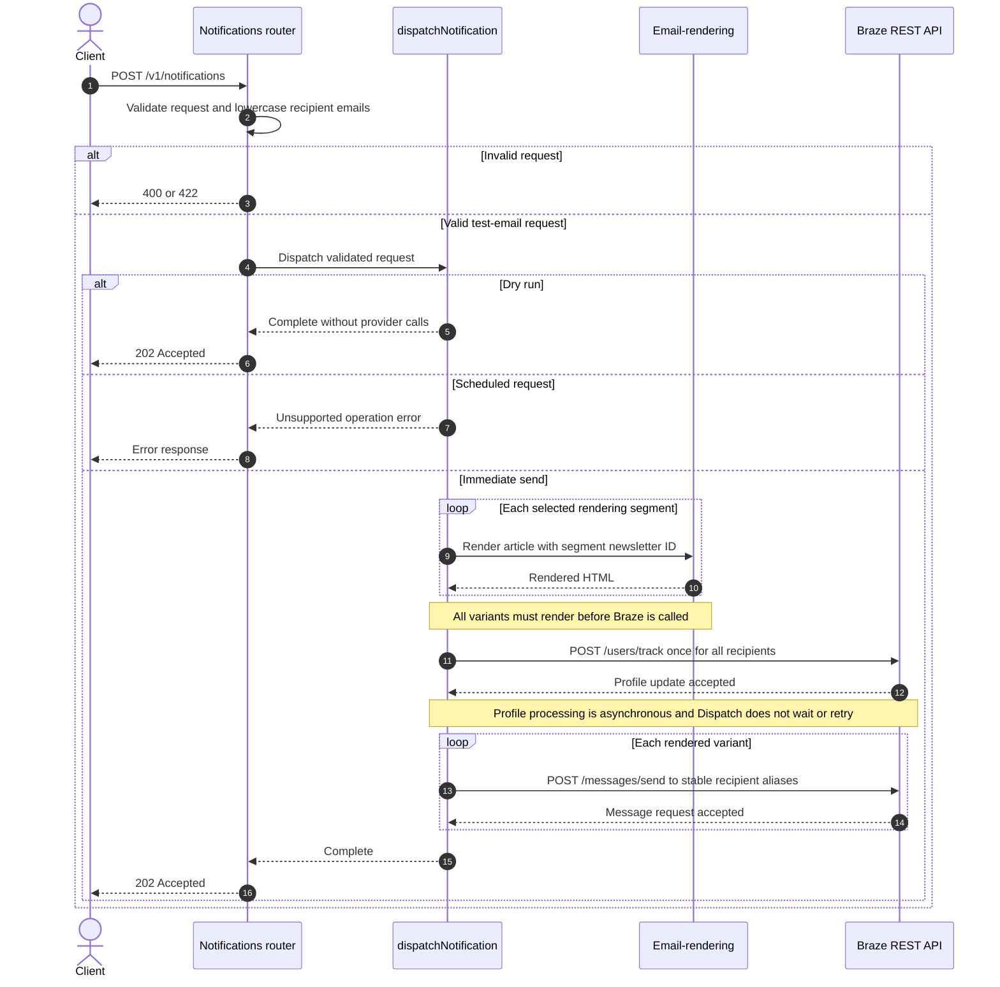

# Braze test email send flow

This document shows how a direct test email moves from the Notifications Tooling
API to email-rendering and Braze. Production Braze campaigns are not involved in
this path.

## Key behaviour

- Recipient addresses are normalized to lowercase and used as alias names under
  the stable `dispatch-tool-test-email` alias label.
- All selected variants are rendered before any Braze request. A rendering
  failure therefore creates no profiles and sends no emails.
- `/users/track` is called once per dispatch, regardless of the number of
  rendering segments.
- `/messages/send` is called once per rendered variant and targets every test
  recipient in the request.
- Direct sends use `recipient_subscription_state: "all"` and do not trigger a
  production campaign.
- Braze calls are sequential. If a later send fails, earlier accepted sends
  cannot be rolled back.
- Dispatch adds no propagation delay and performs no automatic retry. A `202`
  confirms API acceptance, not inbox delivery.
