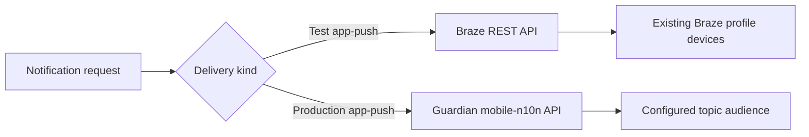
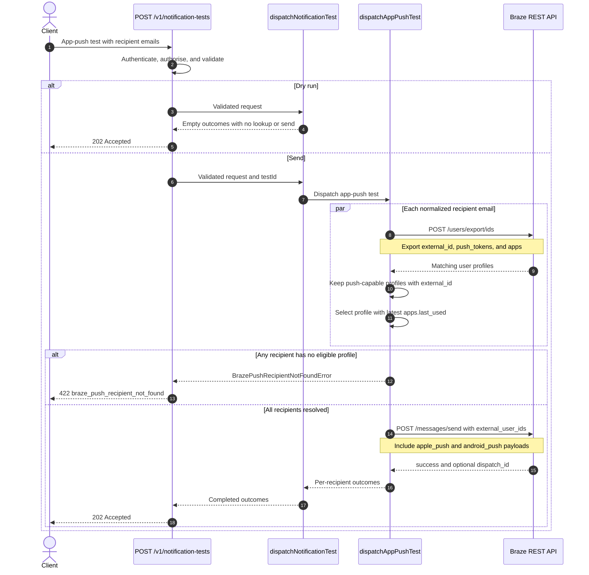

# Braze test app-push send flow

This document describes how `POST /v1/notification-tests` sends app-push tests
to explicit email recipients through Braze. Production app-push delivery remains
separate and continues to use the Guardian mobile notifications API
(mobile-n10n).

## Provider split



A test send deliberately does not exercise mobile-n10n topic resolution or
production audiences. It verifies the composed notification on devices already
registered against a Braze user profile.

## Request shape

The app-push test plan uses email addresses as recipient identifiers:

```json
{
	"idempotencyKey": "test-9c1d5b2a-1f3e-4b7a-8c2d-5e6f7a8b9c0d",
	"content": {
		"items": {
			"lead-story": {
				"type": "app-push",
				"title": "Breaking news",
				"body": "Historic global climate deal reached at the COP summit",
				"link": "https://www.theguardian.com/environment/2026/jul/20/global-climate-deal"
			}
		}
	},
	"channels": {
		"app-push": {
			"audience": {
				"type": "email",
				"items": ["editor@theguardian.com"]
			},
			"compose": { "use": "lead-story" }
		}
	},
	"sender": "notifications-tooling-spa/v1",
	"options": { "dryRun": false }
}
```

## Dispatch sequence



## Recipient resolution

For each lowercased email address, Dispatch calls Braze
`POST /users/export/ids` with:

```json
{
	"email_address": "editor@theguardian.com",
	"fields_to_export": ["external_id", "push_tokens", "apps"]
}
```

A profile is eligible when it has both:

- a non-empty `external_id`;
- at least one exported push token.

If multiple eligible profiles match the email, Dispatch selects the profile
whose exported app activity has the latest `apps.last_used` timestamp. If no
eligible profile remains, the request fails before any push is sent.

The selected `external_id` targets the Braze profile, not one specific token.
Braze determines which eligible iOS and Android devices on that profile receive
the message.

## Braze send

After every recipient has resolved successfully, Dispatch makes one
`POST /messages/send` request:

```json
{
	"external_user_ids": ["resolved-external-user-id"],
	"recipient_subscription_state": "all",
	"messages": {
		"apple_push": {
			"alert": {
				"title": "Breaking news",
				"body": "Historic global climate deal reached at the COP summit"
			},
			"custom_uri": "gnmguardian://environment/2026/jul/20/global-climate-deal",
			"use_webview": false,
			"mutable_content": true,
			"extra": {
				"uniqueIdentifier": "test-notification-id",
				"notificationType": "news",
				"uri": "https://www.theguardian.com/environment/2026/jul/20/global-climate-deal",
				"imageUrl": "https://media.guim.co.uk/article-thumbnail.jpg"
			}
		},
		"android_push": {
			"title": "Breaking news",
			"alert": "Historic global climate deal reached at the COP summit",
			"custom_uri": "https://www.theguardian.com/environment/2026/jul/20/global-climate-deal",
			"use_webview": false,
			"extra": {
				"appboy_image_url": "https://media.guim.co.uk/article-thumbnail.jpg"
			}
		}
	}
}
```

The iOS URI uses the app's `gnmguardian` article route. Android receives the
canonical Guardian URL, with Braze's webview disabled so the app's standard
deep-link handler can open it natively. When the content has image media, its
thumbnail is sent through the Guardian iOS notification extension's `imageUrl`
contract and as an Android big-picture image. The Apple payload includes the
test ID and news metadata required for the extension to decode the notification,
then `mutable_content` allows it to download and attach the image.

No Braze campaign is required. A successful response may include a
`dispatch_id`, which is recorded in each recipient outcome for future
persistence.

## Failure handling

| Condition                                     | API response                         |
| --------------------------------------------- | ------------------------------------ |
| Invalid request or email address              | `400` or `422` validation error      |
| No push-capable Braze profile for a recipient | `422 braze_push_recipient_not_found` |
| Braze rejects a lookup or send                | `502 braze_request_failed`           |
| Braze lookup or send times out                | `504 braze_request_failed`           |
| Successful lookup and send                    | `202 accepted`                       |

Recipient lookup is all-or-nothing: if one requested email cannot be resolved,
Dispatch does not call `/messages/send` for the other recipients.

## Configuration and permissions

The backend reads `BRAZE_API_KEY` and `BRAZE_REST_ENDPOINT`. The Braze API key
requires these permissions for this flow:

- `users.export.ids` for recipient lookup;
- `messages.send` for direct Apple and Android push delivery.

The existing newsletter flows additionally require their documented campaign,
user tracking, and email configuration.

## Swagger coverage

Swagger documents this flow on `POST /v1/notification-tests`:

- the app-push request example uses an `email` audience;
- the endpoint description explains Braze profile resolution;
- `NotificationTestSendRequest` is generated from the runtime Zod schema;
- `BrazePushRecipientError` is included in the documented `422` response;
- `502` and `504` document Braze provider failures.
