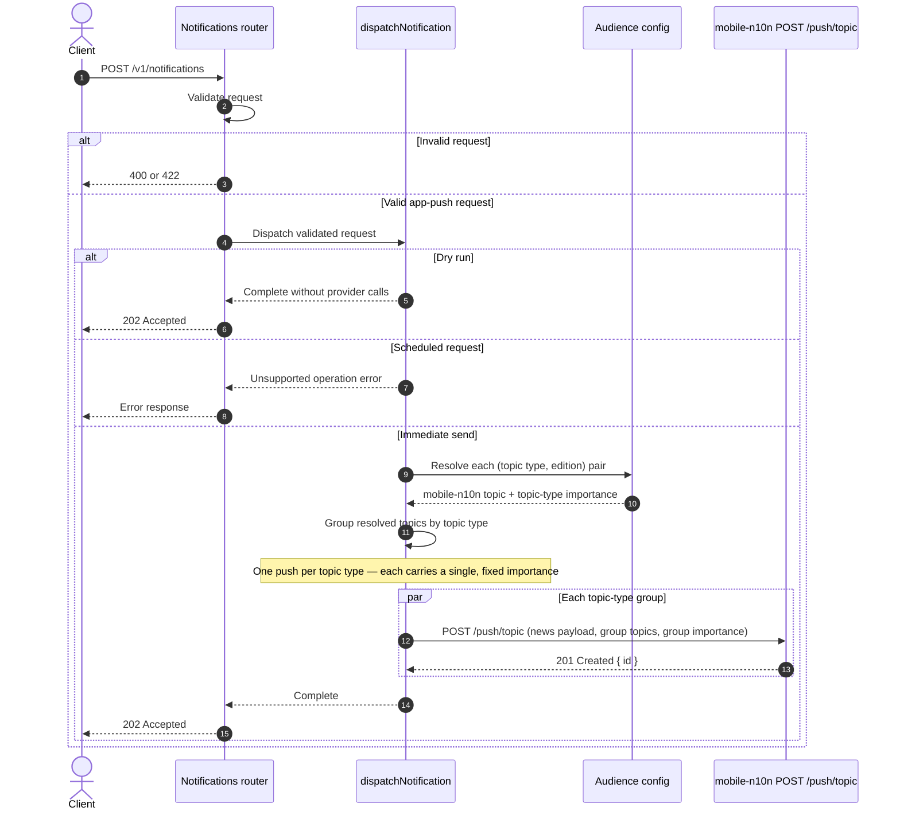

# mobile-n10n topic push flow

This document shows how an app-push notification moves from the Notifications
Tooling API to mobile-n10n. Reader device tokens are never handled here; the API
targets curated topics only, and mobile-n10n fans each push out to the devices
subscribed to those topics.

## Key behaviour

- A request's app-push audience is a list of `(topic type, edition)` pairs. Each
  pair resolves server-side to a mobile-n10n topic (`{ type, name }`); the raw
  coordinates are never exposed in the public contract.
- Dispatch groups the resolved topics by **topic type** and issues **one
  `POST /push/topic` per group**. A request naming one topic type produces one
  push; a request mixing topic types produces one push per type. See
  [mobile-n10n importance and grouping](./mobile-n10n-importance-and-grouping.md).
- Each push carries a single `importance`, taken from its topic type
  (`breaking-news` is `Major`; every other topic type is `Minor`). No push ever
  has to reconcile more than one importance value.
- The payload is a `BreakingNewsPayload` (`type: "news"`). The Guardian article
  link is sent as an external link (`link: { url }`), the title maps to `title`
  and the body to `message`. Optional media populates `imageUrl` and
  `thumbnailUrl`.
- Dispatch sets each push's `id` to `<notificationId>#<topicType>`, where
  `notificationId` is minted by the router before dispatch. The suffix makes the
  id unique per topic-type group and lets a re-send be observed and
  deduplicated. mobile-n10n also returns its own `PushResult` id in the
  `201 Created` body.
- The API key is sent as `Authorization: Bearer <key>`. mobile-n10n scopes each
  key to the topic types it may push to, so an unpermitted topic type is
  rejected upstream.
- mobile-n10n enforces a non-empty topic list and a maximum of 20 topics per
  push. The client guards both bounds before calling out, and the request schema
  caps the total topics a plan may target.
- Per-topic-type pushes are issued in parallel. If one group fails, groups that
  already succeeded cannot be rolled back.
- Dispatch adds no propagation delay and performs no automatic retry. A `202`
  confirms API acceptance and the downstream `201`s, not delivery to devices.
- Provider failures are classified (`AppNotificationApiError`) and mapped by the
  error middleware to `504` on timeout and `502` otherwise, without leaking the
  provider response.
