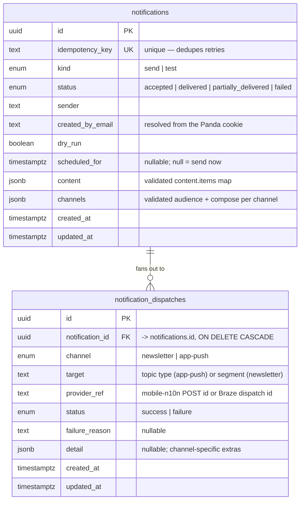

# Notification history data model

**Date:** 2026-08-21
**Status:** Accepted (implements the store chosen in [`docs/ADRs/database.md`](./ADRs/database.md))
**Deciders:** Notifications Mission — Q3 2026

---

## Purpose

This document explains the PostgreSQL schema that backs notification persistence
(`src/packages/database/schema/`) and why its shape is a good fit for two UI
features we intend to deliver on top of it:

1. **Notification list / table view** — a paginated, filterable history of every
   notification that was sent (or scheduled, or dry-run), showing at-a-glance
   who sent what, when, through which channels, and whether it landed.
2. **Notification push introspection** — a drill-down for a single notification
   that shows exactly what was requested and, per channel and per target, which
   downstream provider calls succeeded or failed and why.

The [database ADR](./ADRs/database.md) already decided _that_ we use RDS
PostgreSQL. This document covers _how_ the tables are modelled and the
normalisation trade-offs behind that.

---

## Overview

The schema is intentionally small: an **event** table and a **per-call outcome**
table, in a one-to-many relationship.

- `notifications` — one row per accepted `POST /v1/notifications` (or
  `/v1/notification-tests`) request. It holds the queryable envelope (who, when,
  status, channels used) as first-class columns, plus the full validated request
  `content` and `channels` as `jsonb`.
- `notification_dispatches` — one row per downstream provider call a
  notification fanned out to (one mobile-n10n push per app-push topic type, one
  Braze campaign per newsletter segment). This is what makes per-target
  success/failure introspection possible.

The split maps directly onto the two UI features: the **list view** reads
`notifications` alone; the **introspection view** reads one `notifications` row
together with its `notification_dispatches` children.

---

## Relational diagram

Uniqueness constraints:

- `notifications (idempotency_key)` — a client retry of the same request cannot
  create a second event.
- `notification_dispatches (notification_id, channel, target)` — one row per
  addressed call, so a re-send **upserts** each target's latest outcome instead
  of duplicating it.

---

## Why this fits the UI features

### Notification list / table view

The columns the table view needs to render rows and offer filters are all
first-class scalar columns on `notifications`, so the list is a single indexed
read with no joins or JSON extraction:

| UI need                                                | Backed by                    |
| ------------------------------------------------------ | ---------------------------- |
| Sortable "sent at" / newest-first                      | `created_at`                 |
| Status badge (delivered / partial / failed / accepted) | `status`                     |
| "Who sent this" column & filter                        | `created_by_email`, `sender` |
| Test vs production filter                              | `kind`                       |
| Dry-run / scheduled indicators                         | `dry_run`, `scheduled_for`   |
| Stable row identity & deep-link to detail              | `id`                         |

Rendering "which channels" per row reads the `channels` JSON keys, and does not
require a join to `notification_dispatches`. Because `status` is stored (not
computed on read), the list stays fast as history grows and never needs to
aggregate child rows to colour a badge.

### Notification push introspection

The detail view is exactly the parent-plus-children read the second table was
designed for. The repository already exposes it:

- `notificationsRepository.findByIdWithDispatches(id)` returns the notification
  and its `dispatches[]`, ordered oldest-first, via the Drizzle relational query
  (`src/packages/database/repositories/notifications-repository.ts`).

From those rows the UI can show:

- **What was requested** — `content` and `channels` rendered from the stored
  JSON, i.e. the exact payload the editor composed.
- **What happened, per call** — each `notification_dispatches` row is one
  provider call: `channel` + `target` say _what_ was addressed, `status` /
  `failure_reason` say _how it went_, and `provider_ref` links out to the
  downstream id (mobile-n10n POST id or Braze dispatch id) for cross-system
  tracing.

Because retries upsert on `(notification_id, channel, target)`, the detail view
always reflects the _latest_ outcome per target — a target that failed and then
succeeded on re-send shows as `success`, and nothing is double-counted.

---

## Normalisation

The model is deliberately **normalised where we query and denormalised where we
only render**.

### What is normalised (the relational backbone)

The one-to-many split between `notifications` and `notification_dispatches` is
textbook normalisation. A notification fans out to many provider calls; putting
those calls in their own table means the envelope (sender, timestamps, status,
the two JSON blobs) is stored **once** rather than repeated on every dispatch
row. This removes the update/duplication anomalies that a single wide "one row
per call" table would suffer, and it lets the two UI reads touch only the data
they need.

Within each table, the scalar columns are in **third normal form**: every
non-key attribute depends on the row's primary key and nothing else. A dispatch
row's `channel`, `target`, `status`, `failure_reason` and `provider_ref` are
facts about _that one call_; a notification's `sender`, `kind`, `created_by_email`,
`dry_run` and `scheduled_for` are facts about _that one request_. There are no
transitive dependencies between non-key columns.

### What is deliberately denormalised (and why it's the right call)

Two conscious deviations, both justified by how the data is used:

1. **`content` and `channels` as `jsonb`.** Strictly, a nested JSON document is
   not an atomic scalar, so these columns are not in first normal form. Fully
   normalising them would mean child tables for content items, media, per-channel
   audiences (segments, topic-type/edition pairs, test emails), compose
   references and newsletter variants — a large tree of tables and joins. We
   deliberately do **not** do that because this data is authored as one nested
   document, is only ever read back **whole** for a single notification (the
   introspection view and re-send), and is **never filtered on inner fields** by
   the list view. Storing it verbatim keeps the write a single insert, preserves
   the request exactly as validated (good for audit and re-send fidelity), and
   keeps `@database` decoupled from the backend's zod request contract that owns
   the JSON's shape. The queryable attributes are promoted to real columns; the
   render-only detail stays as JSON. (See also the shorter-lived
   `notification_dispatches.detail` JSON, which absorbs channel-specific extras
   that no query filters on.)

2. **`notifications.status` as a stored rollup.** The "ultimate" status is
   derivable by aggregating the child `notification_dispatches` rows (all
   success → `delivered`, some fail → `partially_delivered`, all fail →
   `failed`, none yet → `accepted`). Storing it denormalises that derived fact
   onto the parent. We accept the small write-time cost of keeping it in sync
   because the **list view** must colour a status badge for potentially thousands
   of rows without aggregating each notification's children on every page load.
   The per-call detail remains the source of truth in `notification_dispatches`;
   `status` is the fast, pre-aggregated read for the table view.

### Summary of the trade-off

| Concern                              | Approach                                                       |
| ------------------------------------ | -------------------------------------------------------------- |
| Data we **filter / sort / badge** on | Normalised scalar columns (3NF)                                |
| Parent ↔ many provider calls         | Separate `notification_dispatches` table (removes duplication) |
| Data we only **render whole**        | `jsonb` (`content`, `channels`, `detail`)                      |
| Fast list badges                     | Denormalised `status` rollup on the parent                     |

This gives us relational guarantees and cheap, index-friendly queries exactly
where the two UI features need them, without exploding the schema into a dozen
tables for data the UI only ever displays as-is.

---

## Consequences and future evolution

- The list view is a single-table, index-backed query; adding filters (channel,
  date range, status) needs indexes, not remodelling.
- The introspection view is a bounded parent + children read, already served by
  `findByIdWithDispatches`.
- If a future feature needs to **query inside** the content/audience data (for
  example "list every notification that targeted the `sport` topic type"), that
  specific access pattern can be served by a GIN index on the `jsonb`, or by
  promoting just that attribute to a column — without unpicking the whole model.
- If richer per-call analytics are needed, `notification_dispatches` is the
  natural place to add columns, since each row is already one provider call.
