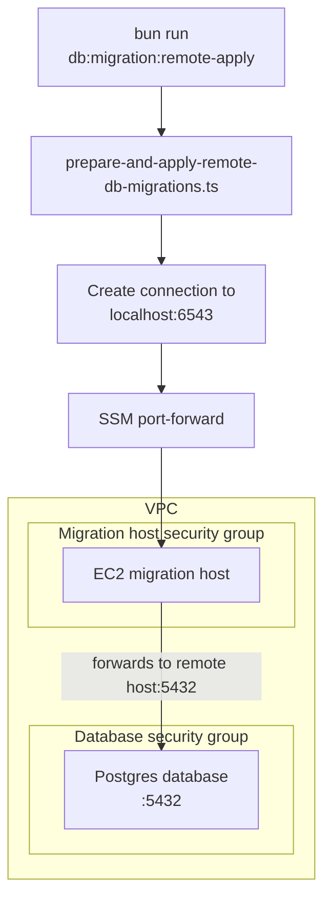

# Database

## Overview

This package owns the local database schema, generated SQL migrations, Drizzle
configuration, and package-level database scripts.

- Schema: `src/packages/database/schema.ts`
- Migrations: `src/packages/database/migrations`
- Drizzle config: `src/packages/database/drizzle.config.ts`

## Environment

Bun and local Docker load environment variables from `.env` in this package
directory.

This applies when commands are run directly from `src/packages/database` and
when they are run from the repository root with Bun workspace filtering, for
example `bun run --filter @database db:reset`.

If this file does not exist, the setup script will try to create it by copying
`.env.example`.

Runtime and tooling load database configuration differently:

- The application runtime uses `runtime-db-config.ts`. In Lambda it fetches
  managed database credentials from Secrets Manager; outside Lambda it falls
  back to the local `DB_*` environment variables.
- Drizzle CLI tooling uses `drizzle.config.ts`, which always reads the local
  `DB_*` environment variables synchronously. This keeps migration commands
  compatible with Drizzle's config loader in local development and CI.

Database-backed tests use a separate database named `${DB_NAME}_test` by
default. Run them with `bun run test:db`; the shared test helper creates the test
database when needed and refuses to run destructive setup against a database
whose name does not end with `_test`. Set `DB_TEST_NAME` to override the name
while keeping that suffix.

## How to run database migrations

Run all commands in this guide from `src/packages/database`:

```bash
cd src/packages/database
```

### Create and test a migration locally

1. Create a migration:

```bash
bun run db:migration:create YOUR_MIGRATION_NAME
```

The wrapper validates the migration name, passes it to Drizzle, and writes
the generated SQL to `migrations`.

2. Review the generated SQL. Check that it preserves existing data and can run
   safely against both CODE and PROD.

3. Validate the migration files:

```bash
bun run db:migration:check
```

4. Apply all pending migrations to the local database:

```bash
bun run db:migration:apply
```

5. Run the database tests from the repository root:

```bash
cd ../../..
bun run test:db
```

### Apply migrations to CODE and PROD

#### Prerequisites

- Install the [AWS CLI](https://docs.aws.amazon.com/cli/latest/userguide/getting-started-install.html).
- Install the [AWS Session Manager plugin](https://docs.aws.amazon.com/systems-manager/latest/userguide/session-manager-working-with-install-plugin.html).
- Retrieve fresh temporary credentials from
  [Janus](https://janus.gutools.co.uk/) for the Composer account and place them
  in the `composer` AWS profile. Select the **Run dispatch locally** developer
  policy; ordinary Composer credentials do not include database migration
  access.
- Ensure local port `6543` is available, or choose another port with
  `--local-port`.

The scripts use the `composer` profile and `eu-west-1` region automatically.
They apply every pending migration; an individual migration cannot be selected.

#### CODE

Apply and verify migrations in CODE before changing PROD:

```bash
bun run db:migration:remote-apply --stage CODE
```

#### PROD

After the CODE migration and application behavior have been verified, apply the
same pending migrations to PROD:

```bash
bun run db:migration:remote-apply --stage PROD
```

There is no interactive PROD confirmation. Check the stage in the command
before running it.

To use a different local port for either stage:

```bash
bun run db:migration:remote-apply --stage CODE --local-port 6544
```

The remote command:

1. Reads the database credentials from Secrets Manager.
2. Resolves the stage's migration host from the CloudFormation stack.
3. Opens an SSM port-forwarding session on the local port.
4. Connects to PostgreSQL over SSL and confirms the database and user.
5. Applies all pending Drizzle migrations.
6. Closes the database connection and SSM session.

You do not need to run `db:migration:tunnel` first.

If AWS reports that no session policy allows `secretsmanager:GetSecretValue`,
the active credentials do not include the required developer policy. Confirm
that the latest CODE infrastructure containing the policy has been deployed,
then return to Janus, select **Run dispatch locally**, and replace the
`composer` profile credentials before retrying. The failed command does not run
any migrations.

Treat a successful command exit as confirmation that Drizzle applied the
pending migrations. For additional verification, connect with DBeaver and
inspect the affected schema or the `drizzle.__drizzle_migrations` table.

Migrations are not rolled back automatically. If one succeeds but needs to be
reversed, create and test a new forward migration, or coordinate any required
manual recovery before deploying dependent application code.

#### Migration diagram



### Connect with DBeaver

Use this when a migration needs manual verification or investigation:

1. Install DBeaver with `brew install --cask dbeaver-community`.
2. Retrieve the username and password from the
   `/[stage]/notifications/dispatch/db` secret in AWS Secrets Manager using the
   `composer` profile.
3. Start a long-lived SSM session for the required stage:

```bash
bun run db:migration:tunnel --stage CODE
# or: bun run db:migration:tunnel --stage PROD
```

4. Create a PostgreSQL connection in DBeaver with:

- Host: `localhost`
- Port: `6543`
- Database: `dispatchdb`
- Username and password: values from the stage's secret

5. Keep the tunnel command running while using DBeaver. Stop it with
   <kbd>Ctrl</kbd>+<kbd>C</kbd> when finished.

### Reset local database

Reset the local database:

```bash
bun run db:reset
```

`db:reset` recreates the local Postgres container, removes local database
files, restarts Postgres, and applies pending migrations from this package.
