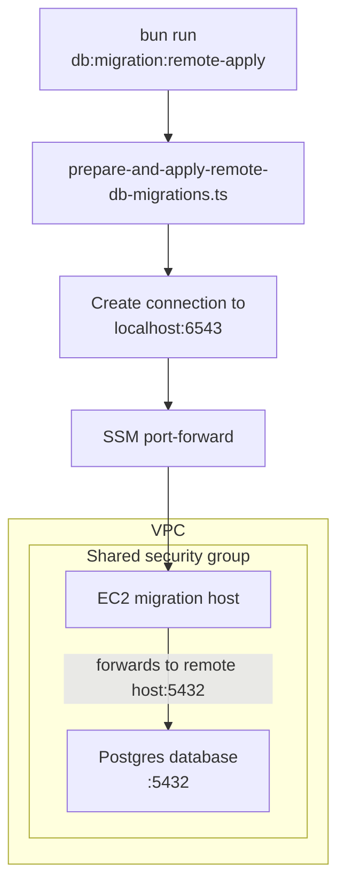

# Database

## Overview

This package owns the local database schema, generated SQL migrations, Drizzle
configuration, and package-level database scripts.

- Schema: `src/packages/database/schema.ts`
- Migrations: `src/packages/database/migrations`
- Drizzle config: `src/packages/database/drizzle.config.ts`

## Environment

Bun and local Docker load environment variables from `.env` in this package
directory.

This applies when commands are run directly from `src/packages/database` and
when they are run from the repository root with Bun workspace filtering, for
example `bun run --filter @database db:reset`.

If this file does not exist, the setup script will try to create it by copying
`.env.example`.

Runtime and tooling load database configuration differently:

- The application runtime uses `runtime-db-config.ts`. In Lambda it fetches
  managed database credentials from Secrets Manager; outside Lambda it falls
  back to the local `DB_*` environment variables.
- Drizzle CLI tooling uses `drizzle.config.ts`, which always reads the local
  `DB_*` environment variables synchronously. This keeps migration commands
  compatible with Drizzle's config loader in local development and CI.

## Database migrations

Run the following commands from `src/packages/database`.

### Local development

Create a migration:

```bash
bun run db:migration:create YOUR_MIGRATION_NAME
```

The wrapper validates the migration name, passes it to Drizzle, and writes the
generated SQL to `src/packages/database/migrations`.

Apply pending migrations:

```bash
bun run db:migration:apply
```

### CODE or PROD

Before running a remote migration command, retrieve fresh temporary developer
credentials for the `composer` AWS profile. These scripts are hardcoded to use
that profile and the `eu-west-1` region to match the current deployment setup.

Apply pending migrations to a remote CODE or PROD database with a single
command:

```bash
bun run db:migration:remote-apply --stage CODE
```

#### Migration diagram



`db:migration:remote-apply` now opens the SSM tunnel for the requested stage,
waits for the forwarded local port, connects over SSL, runs the migration, and
then closes the tunnel.

You do not need to run `db:migration:tunnel` first when using
`db:migration:remote-apply`.

### How to connect to the DB using Dbeaver
1. Download Dbeaver using brew 
    `brew install --cask dbeaver-community`
2. Retrieve the username and password from the `/[stage]/notifications/dispatch/db` secret in AWS Secret Manager using the composer AWS profile.
3. Open the ssm session by running `bun run db:migration:tunnel --stage CODE`. This creates a long lived connection that will run in the terminal.
4. Add a new postgres db connection
5. Fill in the port ( default is `6543`), host `localhost`, database name `dispatchdb`.
6. Fill in the sensitive db credentials (user, password).
7. Finish 

### Reset local database

Reset the local database:

```bash
bun run db:reset
```

`db:reset` recreates the local Postgres container, removes local database
files, restarts Postgres, and applies pending migrations from this package.
