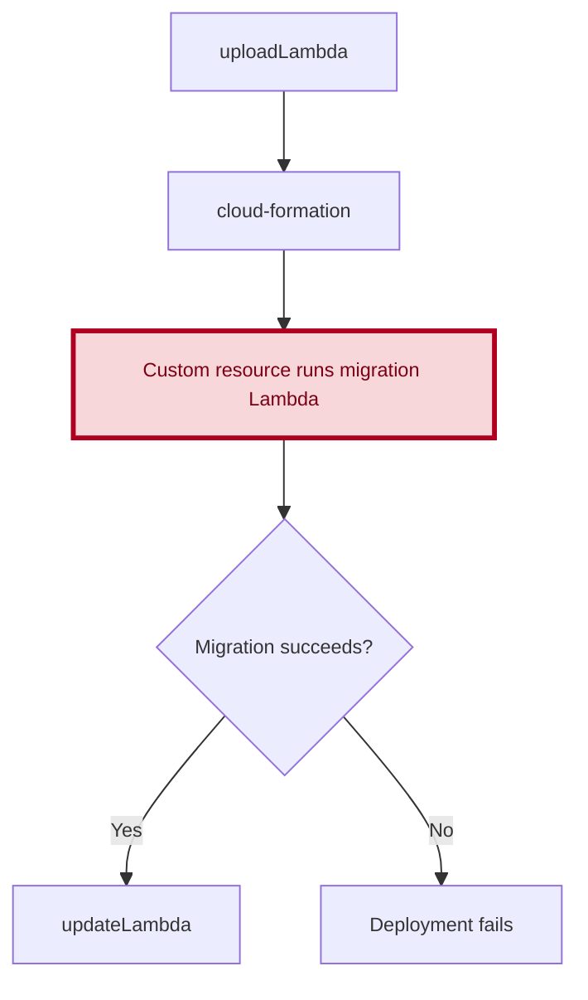
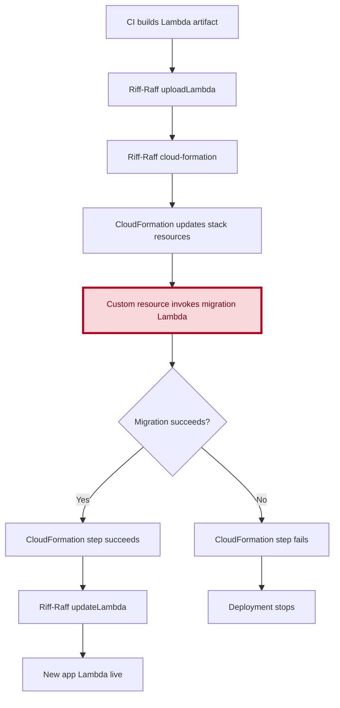
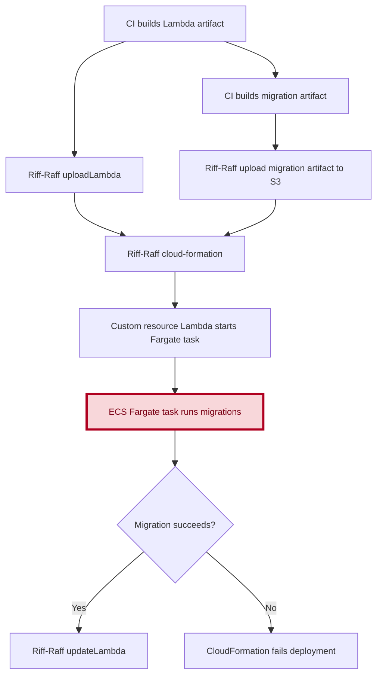

# Notifications Tooling: Dispatch

## Handling Database Migrations in CODE/PROD Deployments

## Contents

- [Local development](#local-development)
- [Deployment to CODE/PROD](#deployment-to-code-prod)
- [Manual deployments through EC2 jump host](#manual-deployments-through-ec2-jump-host)
- [Lambda-backed custom resources](#lambda-backed-custom-resources)
- [ECS Fargate task orchestrated by a CloudFormation custom resource](#ecs-fargate-custom-resource)
- [Other options explored: CloudFormation hooks](#cloudformation-hooks)

<a id="local-development"></a>

## 1. Local Development

Locally, we use Drizzle to manage database schema changes and migrations.

Create a migration:

1. Update the schema.
2. Create the migration.

Where: `/src/packages/database`

Command:

```sh
bun run db:migration:create
```

Apply migrations:

Where: `/src/packages/database`

Command:

```sh
bun run db:migration:apply
```

<a id="deployment-to-code-prod"></a>

## 2. Deployment to CODE/PROD

There are currently no consistent standards across Guardian repositories for how database migrations are handled during deployment. The current practical recommendation is to start with a manual, process-first approach, and only introduce a programmatic deployment-time mechanism if that proves necessary.

<a id="manual-deployments-through-ec2-jump-host"></a>

### 1. Manual deployments through EC2 jump host

DevX advised that, before implementing a programmatic solution, we should first make process changes, such as splitting database and application changes across independent PRs, to reduce the surface area of the problem.

The thinking behind a process-first approach is that a programmatic solution would require more design and operational confidence, including observability and a clear understanding of how it would behave in practice. If process changes prove insufficient, we can then look at introducing a programmatic solution.

#### How would this work?

We can take a look at how Pinboard does this: https://github.com/guardian/pinboard/blob/main/shared/database/local/getDatabaseJumpHost.ts

1. Create a migration runner that uses the database connection and runs the migrations.
2. Spin up an EC2 jump host temporarily, on demand via an ASG. We would need to configure all permissions required so that we can connect to the database.
3. Establish an SSH tunnel to the database.
4. Run the migration runner through the SSH tunnel.
5. Clean up the access path afterward.

#### Pros

1. We avoid changing Riff-Raff or coupling migrations to CloudFormation. Riff-Raff will also be removed in the future.
2. It keeps database access inside controlled infrastructure.
3. It supports a process-first approach.

#### Cons

1. We need a clear permission model for who can create it and who can use it. Will it be the case that only some engineers have permission? Will that create a bottleneck?
2. Do we need to keep an audit trail of who updated what?
3. It is a manual approach that requires developer intervention.

<a id="lambda-backed-custom-resources"></a>

### 2. Lambda-backed custom resources

#### What is it?

A Lambda-backed custom resource is an AWS CloudFormation feature that lets you run custom setup or cleanup code using an AWS Lambda function whenever you create, update, or delete a stack.

#### How would it work?

In practice, this would let the deployment run database migrations as part of the normal stack update rather than as a separate manual or asynchronous step. The migration runner would execute after infrastructure is in place but before the application Lambda is updated, so a failed migration would block the deploy instead of letting new application code roll out against the wrong schema.

The diagrams below show where the migration step would sit in the deployment flow. The first is a simplified view of the control flow, and the second expands it into the concrete Riff-Raff and CloudFormation stages.

#### Deployment flow



#### Deployment steps in more detail



#### What would be required?

1. Add a dedicated migration runner that executes the Drizzle migrations.
2. Package the runner as its own Lambda artifact, separate from the main app Lambda, and include the migration files.
3. Add a migration Lambda to the notifications stack.
4. Ensure the migration Lambda runs in the same VPC and private subnets as the database.
5. Give the migration Lambda a security group that can reach Postgres.
6. Grant it access to the required SSM parameters or secrets.
7. Consider whether it needs a longer timeout than the main app Lambda.
8. Add a Lambda-backed custom resource using the standard AWS CDK custom resource primitives. There is no `guCDK` equivalent.
9. Make the custom resource invoke the migration Lambda during stack update.
10. Fail the stack if the migration fails.
11. Only run the migration handler for `Create` and `Update` events, not for `Delete`.
12. Add a rerun trigger. CloudFormation only reruns a custom resource when its properties change, so we would need to pass something versioned, such as a migration artifact hash or a build ID.

Keep migrations forward-safe:

- Ensure idempotency if retries happen.
- Treat recovery as fix-forward rather than rolling back the schema.
- Use advisory locking when running migrations.

#### Pros

1. If database migrations fail, the CloudFormation step fails and the deployment stops, so migrations become a gatekeeper for a successful deployment.
2. It fits the existing `guCDK` + Riff-Raff flow. We would not need a separate orchestration path because migrations would run inside the normal deployment sequence.
3. It keeps migration execution out of app startup, so we avoid cold start side effects and multiple app instances trying to migrate.
4. It gives clearer deployment ordering: infrastructure is prepared first, migrations run next, and only then is the Lambda updated.

#### Cons

1. It tightly couples schema migration to the CloudFormation lifecycle. Ideally, these concerns would remain more loosely coupled because they have different responsibilities.
2. Lambda has a bounded execution time of 15 minutes. Based on what we currently know about usage of the tool, this may not be a practical issue, but it is still a constraint to consider.
3. CloudFormation can roll back infrastructure resources, but it does not know how to roll back schema changes. We should follow an inspect-and-fix-forward plan for failed database migrations.
4. Concurrency control remains our responsibility. If overlapping deploys happen, we need a locking mechanism so only one migration runner mutates the database at a time.

<a id="ecs-fargate-custom-resource"></a>

### 3. ECS Fargate task orchestrated by a CloudFormation custom resource

This approach is similar to [Lambda-backed custom resources](#lambda-backed-custom-resources), but instead of running the migrations directly in the Lambda handler, it starts an ECS Fargate task to perform the migrations. This approach is likely to work best when the migrations need more packaging flexibility or runtime headroom than Lambda can provide.

#### How would it work?

In this model, the migration runner is still decoupled from the main application Lambda, but it remains part of the deployment gate. The migration artifact is uploaded first, CloudFormation then runs a custom resource, and that custom resource starts the Fargate task in the correct VPC. The deployment waits for the task to complete, and fails if the task exits unsuccessfully.

#### Deployment flow



#### Pros

1. The migration runner executes in a dedicated environment with fewer Lambda runtime constraints than a pure Lambda runner.
2. It keeps migration execution separate from the main application Lambda and avoids running migrations during app startup.
3. It still acts as a real deployment gate because CloudFormation waits for the Fargate task to finish and fails if it does not succeed.

#### Cons

1. It adds a few layers of complexity: ECS task definitions, orchestration logic, and polling.
2. It still relies on a custom resource Lambda to coordinate the Fargate task, so the overall deployment path is more complex than a single in-process migration runner.
3. It requires concurrency control, observability, and a clear retry model.
4. It introduces another artifact and another runtime surface area to build, package, and maintain.

<a id="cloudformation-hooks"></a>

### 4. Other options explored: CloudFormation hooks

CloudFormation hooks were also considered. They are a separate extension point that can inspect or block resource changes during a stack update, but they are more naturally suited to validation and policy enforcement than to running database migrations as a dedicated step.

#### How would it work?

In this model, the hook decides whether a resource update can go ahead or not. The hook acts more like a validator and blocks changes rather than acting as a clear migration step in the deployment flow.

#### Pros

1. Hooks align with the longer-term direction of making deployments CloudFormation-driven rather than Riff-Raff-specific.

#### Cons

1. Hooks are a less natural fit for actually running database migrations because they are designed to intercept resource lifecycle events rather than represent a dedicated migration step.
2. They have a broader scope. Hooks are more platform-level behaviour than stack-level behaviour.
3. We would still need to decide which resource changes should trigger the hook and how that maps onto database migration intent. It can feel unnatural to tie schema changes to some resource being updated rather than to an explicit migration step.
